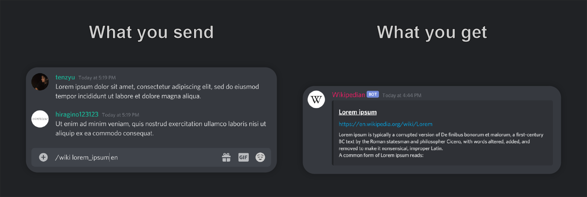

# Wikipedian

> Wikipedian is a Discord Bot that allows you to search wikipedia in a better way.

## [✉️ Invite to your server](https://discord.com/api/oauth2/authorize?client_id=751430120962785360&permissions=84992&scope=bot)

## Usage

### `/wiki <location> <keyword>`

Search a article that contains ` keyword ` from Wikipedia and send message with an embed.

For example: `/wiki ja イデア論`, `/wiki en lorem ipsum`

### `/search <keyword>`

Search for articles on Wikipedia by ` keyword ` and send them as a list with an embed.

## Required Permissions

- Read Messages
- Send Messages
- Embed Links
- Read Message History
